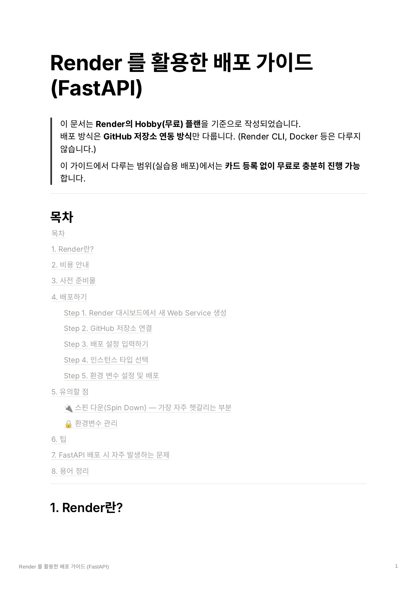
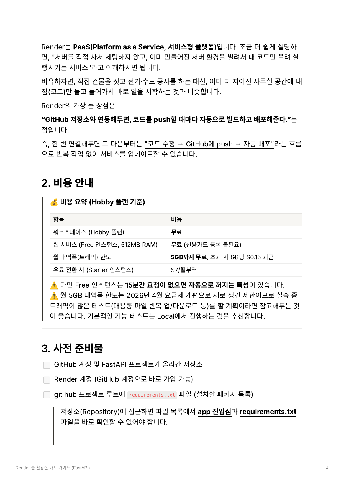
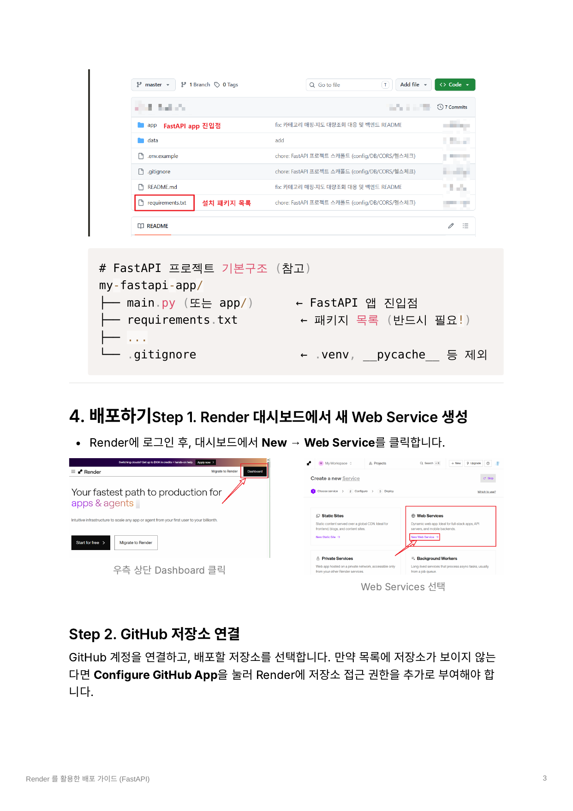
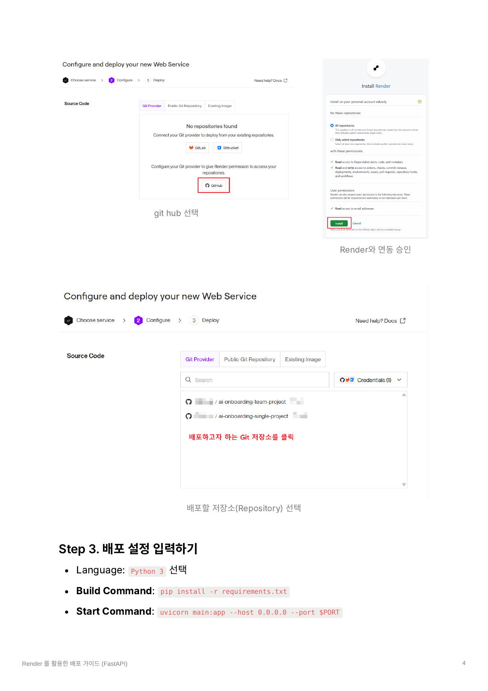
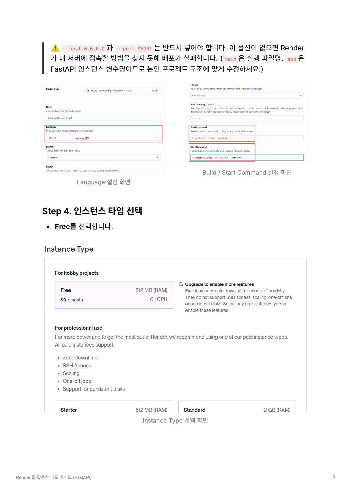
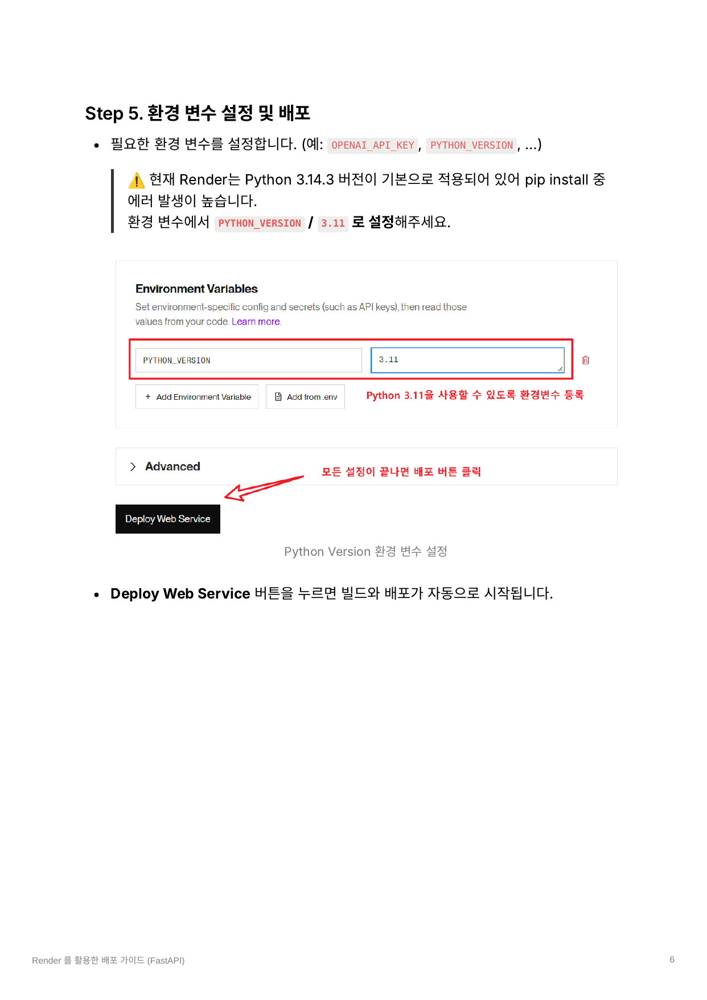
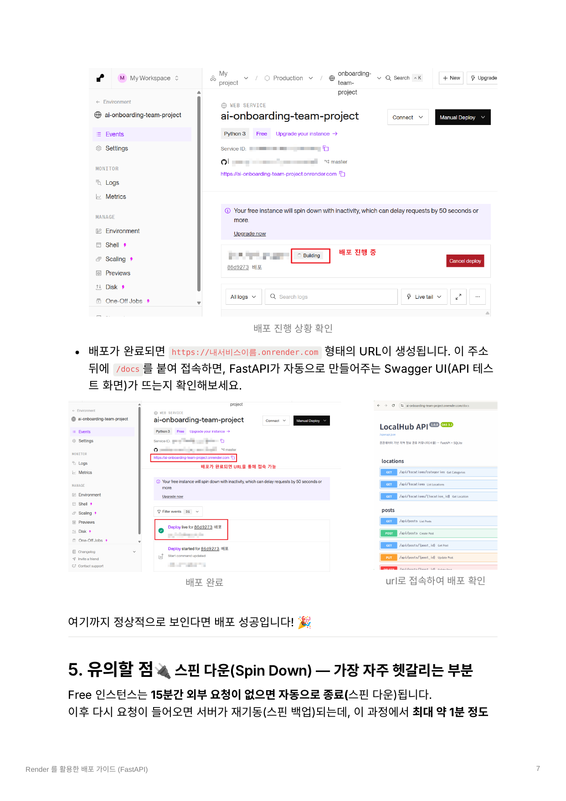
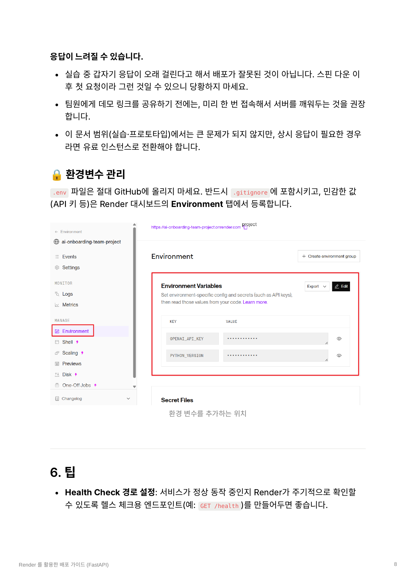
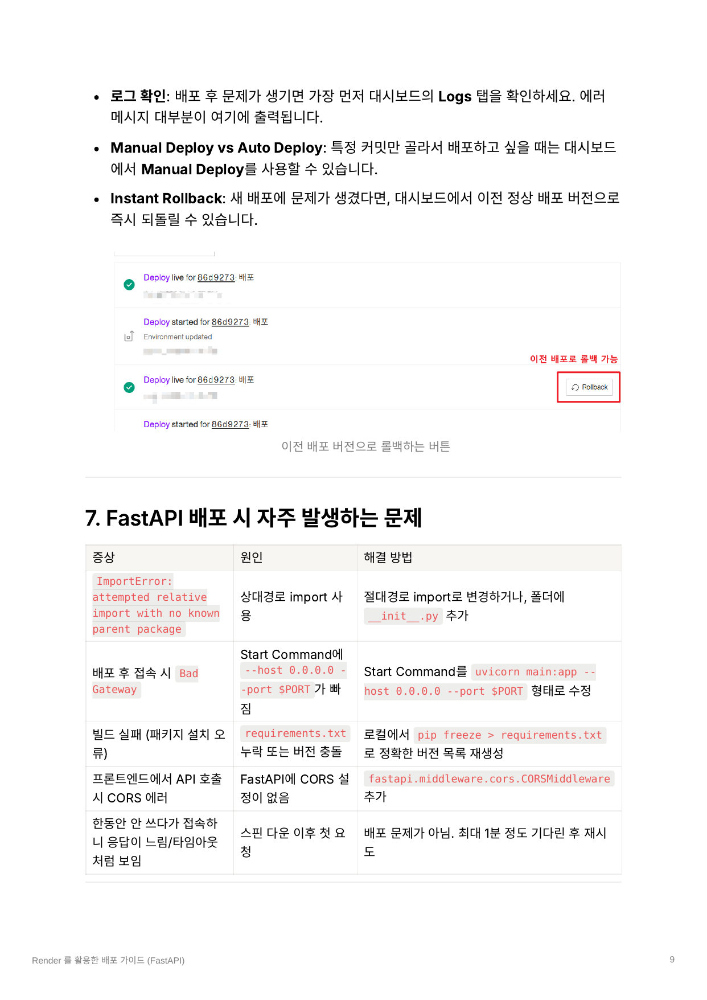
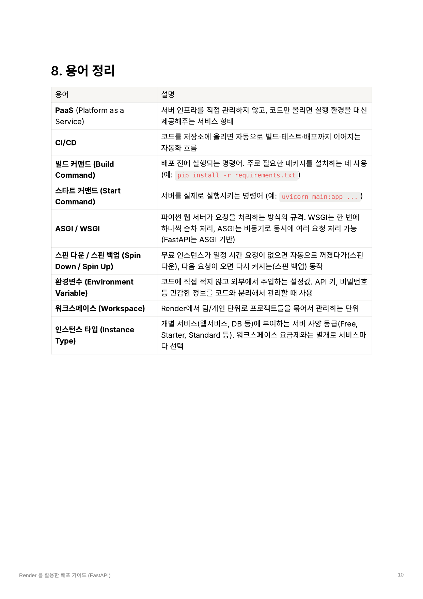

# Render를 활용한 배포 가이드 (FastAPI)

> 원본: `01_Render를_활용한_배포_가이드_(FastAPI) (2).pdf`  
> 원본은 총 10페이지이며, 본 문서는 본문·표·명령어·주의사항을 Markdown으로 전사했습니다. 화면 캡처와 이미지 내부의 빨간 주석까지 보존하기 위해 각 절에 원본 페이지 렌더 이미지를 함께 수록했습니다.

이 문서는 Render의 Hobby(무료) 플랜을 기준으로 작성되었습니다.

배포 방식은 GitHub 저장소 연동 방식만 다룹니다. Render CLI, Docker 등은 다루지 않습니다.

이 가이드에서 다루는 범위(실습용 배포)에서는 카드 등록 없이 무료로 충분히 진행 가능합니다.

## 목차

1. [Render란?](#1-render란)
2. [비용 안내](#2-비용-안내)
3. [사전 준비물](#3-사전-준비물)
4. [배포하기](#4-배포하기)
   - [Step 1. Render 대시보드에서 새 Web Service 생성](#step-1-render-대시보드에서-새-web-service-생성)
   - [Step 2. GitHub 저장소 연결](#step-2-github-저장소-연결)
   - [Step 3. 배포 설정 입력하기](#step-3-배포-설정-입력하기)
   - [Step 4. 인스턴스 타입 선택](#step-4-인스턴스-타입-선택)
   - [Step 5. 환경 변수 설정 및 배포](#step-5-환경-변수-설정-및-배포)
5. [유의할 점](#5-유의할-점)
   - [스핀 다운(Spin Down)](#스핀-다운spin-down---가장-자주-헷갈리는-부분)
   - [환경변수 관리](#환경변수-관리)
6. [팁](#6-팁)
7. [FastAPI 배포 시 자주 발생하는 문제](#7-fastapi-배포-시-자주-발생하는-문제)
8. [용어 정리](#8-용어-정리)

## 원본 1페이지



## 1. Render란?

Render는 **PaaS(Platform as a Service, 서비스형 플랫폼)**입니다. 조금 더 쉽게 설명하면, "서버를 직접 사서 세팅하지 않고, 이미 만들어진 서버 환경을 빌려서 내 코드만 올려 실행시키는 서비스"라고 이해하시면 됩니다.

비유하자면, 직접 건물을 짓고 전기·수도 공사를 하는 대신, 이미 다 지어진 사무실 공간에 내 짐(코드)만 들고 들어가서 바로 일을 시작하는 것과 비슷합니다.

Render의 가장 큰 장점은 다음과 같습니다.

> **"GitHub 저장소와 연동해두면, 코드를 push할 때마다 자동으로 빌드하고 배포해준다."**

즉, 한 번 연결해두면 그 다음부터는 다음 흐름으로 반복 작업 없이 서비스를 업데이트할 수 있습니다.

```text
코드 수정 -> GitHub에 push -> 자동 배포
```

## 2. 비용 안내

### 비용 요약(Hobby 플랜 기준)

| 항목 | 비용 |
|---|---|
| 워크스페이스(Hobby 플랜) | 무료 |
| 웹 서비스(Free 인스턴스, 512MB RAM) | 무료(신용카드 등록 불필요) |
| 월 대역폭(트래픽) 한도 | 5GB까지 무료, 초과 시 GB당 $0.15 과금 |
| 유료 전환 시(Starter 인스턴스) | $7/월부터 |

> [!WARNING]
> Free 인스턴스는 **15분간 요청이 없으면 자동으로 꺼지는** 특성이 있습니다.

> [!WARNING]
> 월 5GB 대역폭 한도는 2026년 4월 요금제 개편으로 새로 생긴 제한입니다. 실습 중 트래픽이 많은 테스트(대용량 파일 반복 업로드·다운로드 등)를 할 계획이라면 참고해두는 것이 좋습니다. 기본적인 기능 테스트는 Local에서 진행하는 것을 추천합니다.

## 3. 사전 준비물

- [ ] GitHub 계정 및 FastAPI 프로젝트가 올라간 저장소
- [ ] Render 계정(GitHub 계정으로 바로 가입 가능)
- [ ] GitHub 프로젝트 루트의 `requirements.txt` 파일(설치할 패키지 목록)

저장소(Repository)에 접근하면 파일 목록에서 **app 진입점**과 **requirements.txt** 파일을 바로 확인할 수 있어야 합니다.

## 원본 2페이지



### FastAPI 프로젝트 기본 구조(참고)

```text
my-fastapi-app/
├── main.py (또는 app/)      <- FastAPI 앱 진입점
├── requirements.txt         <- 패키지 목록(반드시 필요!)
├── ...
└── .gitignore               <- .venv, __pycache__ 등 제외
```

## 4. 배포하기

### Step 1. Render 대시보드에서 새 Web Service 생성

Render에 로그인한 후 대시보드에서 **New -> Web Service**를 클릭합니다.

화면 안내:

1. 우측 상단의 Dashboard 클릭
2. Web Services 선택

### Step 2. GitHub 저장소 연결

GitHub 계정을 연결하고 배포할 저장소를 선택합니다.

만약 목록에 저장소가 보이지 않는다면 **Configure GitHub App**을 눌러 Render에 저장소 접근 권한을 추가로 부여해야 합니다.

화면 안내:

1. GitHub 선택
2. Render와 연동 승인
3. 배포하고자 하는 Git 저장소 클릭
4. 배포할 저장소(Repository) 선택

## 원본 3페이지



## 원본 4페이지 - GitHub 연결 화면



### Step 3. 배포 설정 입력하기

- **Language:** Python 3 선택
- **Build Command:**

  ```bash
  pip install -r requirements.txt
  ```

- **Start Command:**

  ```bash
  uvicorn main:app --host 0.0.0.0 --port $PORT
  ```

> [!WARNING]
> `--host 0.0.0.0`과 `--port $PORT`는 반드시 넣어야 합니다. 이 옵션이 없으면 Render가 서버에 접속할 방법을 찾지 못해 배포가 실패합니다.

`main`은 실행 파일명이고 `app`은 FastAPI 인스턴스 변수명이므로 본인 프로젝트 구조에 맞게 수정해야 합니다.

화면에서 확인할 항목:

- Language 설정
- Root Directory(모노레포인 경우 해당 서비스 디렉터리 입력)
- Branch
- Region
- Build Command
- Start Command

### Step 4. 인스턴스 타입 선택

**Free**를 선택합니다.

원본 화면에 표시된 Free 인스턴스 정보:

- 512MB RAM
- 0.1 CPU
- $0/month
- 일정 시간 비활성 상태가 지속되면 스핀 다운
- SSH, Scaling, One-off jobs, Persistent disks 미지원

## 원본 5페이지



### Step 5. 환경 변수 설정 및 배포

필요한 환경 변수를 설정합니다.

예:

- `OPENAI_API_KEY`
- `PYTHON_VERSION`
- 그 밖에 프로젝트가 요구하는 환경 변수

> [!WARNING]
> 문서 작성 시점 기준 Render는 Python 3.14.3 버전이 기본 적용되어 있어 `pip install` 중 에러 발생 가능성이 높습니다. 환경 변수에서 `PYTHON_VERSION`을 `3.11`로 설정합니다.

환경 변수 예시:

```text
KEY=PYTHON_VERSION
VALUE=3.11
```

모든 설정이 끝나면 **Deploy Web Service** 버튼을 클릭합니다. 버튼을 누르면 빌드와 배포가 자동으로 시작됩니다.

## 원본 6페이지



### 배포 상태 및 성공 확인

Render 서비스의 **Events** 또는 배포 화면에서 상태가 `Building`인지 확인합니다.

배포가 완료되면 다음 형태의 URL이 생성됩니다.

```text
https://내서비스이름.onrender.com
```

생성된 주소 뒤에 `/docs`를 붙여 접속합니다.

```text
https://내서비스이름.onrender.com/docs
```

FastAPI가 자동으로 만들어주는 Swagger UI(API 테스트 화면)가 표시되는지 확인합니다.

여기까지 정상적으로 보인다면 배포 성공입니다.

## 원본 7페이지



## 5. 유의할 점

### 스핀 다운(Spin Down) - 가장 자주 헷갈리는 부분

Free 인스턴스는 **15분간 외부 요청이 없으면 자동으로 종료(스핀 다운)**됩니다.

이후 다시 요청이 들어오면 서버가 재기동(스핀 업)되는데, 이 과정에서 최대 약 1분 정도 응답이 느려질 수 있습니다.

- 실습 중 갑자기 응답이 오래 걸린다고 해서 배포가 잘못된 것이 아닙니다.
- 스핀 다운 이후 첫 요청이라 느린 것일 수 있으니 당황하지 마세요.
- 팀원에게 데모 링크를 공유하기 전에는 미리 한 번 접속해서 서버를 깨워두는 것을 권장합니다.
- 이 문서 범위(실습·프로토타입)에서는 큰 문제가 되지 않지만, 상시 응답이 필요한 경우 유료 인스턴스로 전환해야 합니다.

### 환경변수 관리

`.env` 파일은 절대 GitHub에 올리지 마세요.

- 반드시 `.gitignore`에 포함합니다.
- API 키 등 민감한 값은 Render 대시보드의 **Environment** 탭에서 등록합니다.
- 화면의 Environment Variables 영역에서 Key와 Value를 입력합니다.

## 6. 팁

### Health Check 경로 설정

서비스가 정상 동작 중인지 Render가 주기적으로 확인할 수 있도록 헬스 체크용 엔드포인트를 만들어두면 좋습니다.

예:

```http
GET /health
```

## 원본 8페이지



### 로그 확인

배포 후 문제가 생기면 가장 먼저 대시보드의 **Logs** 탭을 확인합니다. 에러 메시지 대부분이 여기에 출력됩니다.

### Manual Deploy와 Auto Deploy

특정 커밋만 골라서 배포하고 싶을 때는 대시보드에서 **Manual Deploy**를 사용할 수 있습니다.

### Instant Rollback

새 배포에 문제가 생겼다면 대시보드에서 이전 정상 배포 버전으로 즉시 되돌릴 수 있습니다.

화면의 이전 배포 항목에서 **Rollback** 버튼을 사용합니다.

## 7. FastAPI 배포 시 자주 발생하는 문제

| 증상 | 원인 | 해결 방법 |
|---|---|---|
| `ImportError: attempted relative import with no known parent package` | 상대경로 import 사용 | 절대경로 import로 변경하거나 폴더에 `__init__.py` 추가 |
| 배포 후 접속 시 Bad Gateway | Start Command에 `--host 0.0.0.0 --port $PORT`가 빠짐 | Start Command를 `uvicorn main:app --host 0.0.0.0 --port $PORT` 형태로 수정 |
| 빌드 실패(패키지 설치 오류) | `requirements.txt` 누락 또는 버전 충돌 | 로컬에서 `pip freeze > requirements.txt`로 정확한 버전 목록 재생성 |
| 프론트엔드에서 API 호출 시 CORS 에러 | FastAPI에 CORS 설정이 없음 | `fastapi.middleware.cors.CORSMiddleware` 추가 |
| 한동안 안 쓰다가 접속하니 응답이 느림·타임아웃처럼 보임 | 스핀 다운 이후 첫 요청 | 배포 문제가 아님. 최대 1분 정도 기다린 후 재시도 |

## 원본 9페이지



## 8. 용어 정리

| 용어 | 설명 |
|---|---|
| PaaS(Platform as a Service) | 서버 인프라를 직접 관리하지 않고 코드만 올리면 실행 환경을 대신 제공해주는 서비스 형태 |
| CI/CD | 코드를 저장소에 올리면 자동으로 빌드·테스트·배포까지 이어지는 자동화 흐름 |
| 빌드 커맨드(Build Command) | 배포 전에 실행되는 명령어. 주로 필요한 패키지를 설치하는 데 사용. 예: `pip install -r requirements.txt` |
| 스타트 커맨드(Start Command) | 서버를 실제로 실행시키는 명령어. 예: `uvicorn main:app ...` |
| ASGI / WSGI | 파이썬 웹 서버가 요청을 처리하는 방식의 규격. WSGI는 한 번에 하나씩 순차 처리하고, ASGI는 비동기로 동시에 여러 요청 처리가 가능합니다. FastAPI는 ASGI 기반입니다. |
| 스핀 다운 / 스핀 업(Spin Down / Spin Up) | 무료 인스턴스가 일정 시간 요청이 없으면 자동으로 꺼졌다가(스핀 다운), 다음 요청이 오면 다시 켜지는(스핀 업) 동작 |
| 환경변수(Environment Variable) | 코드에 직접 적지 않고 외부에서 주입하는 설정값. API 키, 비밀번호 등 민감한 정보를 코드와 분리해서 관리할 때 사용 |
| 워크스페이스(Workspace) | Render에서 팀·개인 단위로 프로젝트들을 묶어서 관리하는 단위 |
| 인스턴스 타입(Instance Type) | 개별 서비스(웹서비스, DB 등)에 부여하는 서버 사양 등급(Free, Starter, Standard 등). 워크스페이스 요금제와는 별개로 서비스마다 선택 |

## 원본 10페이지



## 배포 절차 한눈에 보기

```text
1. GitHub에 FastAPI 프로젝트와 requirements.txt 준비
2. Render 로그인
3. New -> Web Service
4. GitHub 계정 및 저장소 연결
5. Language를 Python 3으로 선택
6. Build Command 설정
   pip install -r requirements.txt
7. Start Command 설정
   uvicorn main:app --host 0.0.0.0 --port $PORT
8. Free 인스턴스 선택
9. PYTHON_VERSION=3.11 및 필요한 환경 변수 등록
10. Deploy Web Service 실행
11. Events와 Logs에서 배포 상태 확인
12. 생성된 URL과 /docs 접속 확인
13. 문제 발생 시 Logs, Manual Deploy, Rollback 활용
```

