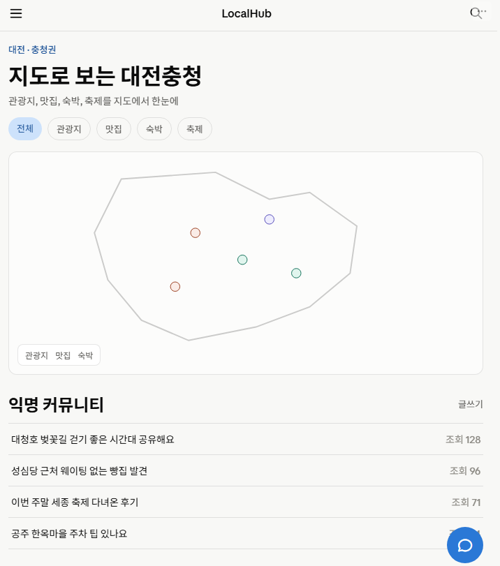

# 선택기능 평가

## 평가기준

- 구현 난이도 (1~5. 낮을수록 쉬움)

- 실현 가능성 (1~5)

- 기대 효과 (1~5)

- 종합 점수 = (6 - 구현난이도) x (실현 가능성) x (기대 효과)

| 선택 기능              | 설명                                               | 구현 난이도 | 실현 가능성 | 기대 효과 | 종합 점수 | 선정 여부 |
|------------------------|----------------------------------------------------|-------------|-------------|-----------|-----------|-----------|
| 지도 시각화            | Leaflet.js 기반 관광지·맛집 위치 표시 및 권역 필터 | 3           | 5           | 5         | 75        | 선정      |
| 날씨 정보 연동         | 외부 API 연동으로 현재 날씨 및 여행 적합도 제공    | 2           | 5           | 4         | 80        | 선정      |
| 축제 캘린더            | FullCalendar 기반 축제 일정 표시                   | 2           | 5           | 4         | 80        | 제외      |
| 소셜 공유 연동         | 카카오톡 공유 및 링크 복사                         | 2           | 5           | 3         | 60        | 제외      |
| 데이터 시각화 대시보드 | Chart.js 기반 통계 시각화                          | 3           | 4           | 3         | 36        | 제외      |
| 경로 안내              | 지도 기반 이동 경로 제공                           | 4           | 2           | 5         | 20        | 제외      |
| 실시간 안내            | WebSocket 기반 게시글 알림                         | 5           | 1           | 4         | 4         | 제외      |
| 다국어 지원            | i18n 기반 다국어 서비스                            | 4           | 2           | 3         | 12        | 제외      |

# 필수/제약/선택 기능

## 필수 조건

| 구분 | 항목                   | 상세내용                                                                             | 근거 조항                       | 검토 의견                                                                    |
|------|------------------------|--------------------------------------------------------------------------------------|---------------------------------|------------------------------------------------------------------------------|
| 필수 | 대상 권역 선정         | 서울, 대전/충청, 구미/경북, 광주/전라, 부산 중 1개 권역을 선정하여 서비스 구축       | II-2, p.1                       | 권역 선정이 데이터 구조·UI·챗봇 답변 범위를 결정하므로 착수 즉시 확정해야 함 |
| 필수 | 서비스 형태            | 지역 주민과 관광객이 정보를 공유하고 소비하는 익명 지역 정보 커뮤니티(LocalHub) 구축 | II-2, p.1                       | 관광정보 제공과 커뮤니티 기능을 함께 제공하는 서비스 구현                    |
| 필수 | 제공 JSON 연동         | 고객사가 제공한 JSON을 기반으로 프론트엔드·백엔드 데이터 연동                        | III-제공 데이터 활용 가, p.1    | JSON 파싱 및 검색 기능 중심으로 구현                                         |
| 필수 | 데이터 출처 문서화     | 데이터 출처·라이선스·수집일을 기능 명세서에 포함                                     | III-제공 데이터 활용 다, pp.1~2 | 데이터 명세서를 별도로 작성                                                  |
| 필수 | 익명 커뮤니티          | 로그인 없이 게시글 작성·조회 가능한 커뮤니티 구현                                    | III-커뮤니티 가, p.2            | 회원 기능 없이 구현                                                          |
| 필수 | 게시글 입력 항목       | 제목, 내용, 수정용 비밀번호 입력                                                     | III-커뮤니티 나, p.2            | 작성 API 및 화면에 모두 포함                                                 |
| 필수 | 수정·삭제 권한 확인    | 등록한 비밀번호 일치 여부만으로 수정·삭제 허용                                       | III-커뮤니티 나, p.2            | 비밀번호 확인 모달 및 검증 API 필요                                          |
| 필수 | 게시판 CRUD            | 목록, 상세, 작성, 수정, 삭제 기능 구현                                               | III-커뮤니티 다, p.2            | FastAPI REST API + Vue 화면 구현                                             |
| 필수 | 카테고리 게시판        | 선정 권역 기준 관광지·맛집 등 카테고리 게시판 구성                                   | III-커뮤니티 다, p.2            | 카테고리 구조를 초기 설계에서 확정                                           |
| 필수 | 챗봇 API               | FastAPI POST /api/chat 구현                                                          | III-챗봇 가, p.2                | OpenAI API 연동 기반                                                         |
| 필수 | 챗봇 데이터 범위       | 제공 JSON 기반 지역 정보 질의응답                                                    | III-챗봇 가, p.2                | 제공 JSON을 검색하여 답변하도록 구현                                         |
| 필수 | 챗봇 주요 질의         | 관광지 추천, 축제 일정, 맛집 위치, 게시글 검색 등 응답                               | III-챗봇 나, p.2                | 대표 질문 시나리오 준비                                                      |
| 필수 | 챗봇 UI                | 대화 히스토리 유지, 모바일 대응, 플로팅 UI                                           | III-챗봇 다, p.2                | 와이어프레임 준수                                                            |
| 필수 | 프론트엔드 기술        | Vue.js 3 기반 SPA                                                                    | III-프론트엔드 가, p.2          | 기술 스택 변경 불가                                                          |
| 필수 | 백엔드 기술            | FastAPI 기반 REST API                                                                | III-백엔드 가, p.2              | OpenAPI 문서 활용 가능                                                       |
| 필수 | ORM 적용               | SQLAlchemy ORM 사용                                                                  | III-백엔드 가, p.2              | SQLite 스키마 설계 포함                                                      |
| 필수 | SQLite 사용            | SQLite DB로 서비스 데이터 관리                                                       | II-2, III-백엔드 가             | 제출용 DB와 동일하게 관리                                                    |
| 필수 | 프론트엔드 배포        | Netlify 배포                                                                         | III-배포 가, p.2                | 외부 접속 가능 URL 제출                                                      |
| 필수 | 백엔드 배포            | Render 배포                                                                          | III-배포 나, p.2                | 배포 후 정상 동작 확인                                                       |
| 필수 | 배포 URL 검증          | Netlify·Render URL 제출                                                              | III-배포 다, p.2                | CORS 및 API 연결 확인                                                        |
| 필수 | 소스코드 산출물        | 프론트·백엔드 Repository 제출                                                        | IV 참고 1, p.3                  | .env 제외 확인                                                               |
| 필수 | DB 산출물              | SQLite(.db) 제출                                                                     | IV 참고 1, p.3                  | 초기 데이터 포함                                                             |
| 필수 | 배포 산출물            | Netlify·Render URL 제출                                                              | IV 참고 1, p.3                  | 외부 접근 가능 상태 유지                                                     |
| 필수 | 기능 명세서            | PDF 또는 DOCX 제출                                                                   | IV 참고 1, p.3                  | 데이터 출처 포함                                                             |
| 필수 | WBS                    | 개발 일정 및 역할 분담 문서                                                          | IV 참고 1, p.3                  | 일정 관리 필수                                                               |
| 필수 | 발표 자료              | PPT 또는 PDF 제출                                                                    | IV 참고 1, p.3                  | 시연 흐름 및 역할 포함                                                       |
| 필수 | 선택 기능 최소 구현    | 선택 기능 1개 이상 구현                                                              | IV 참고 2, p.3                  | 본 프로젝트는 2개 구현 예정                                                  |
| 필수 | 기술 검토 및 일정 초안 | 기술 검토 의견 및 개발 일정 작성                                                     | V-6, p.8                        | 착수 전 계획 수립                                                            |

## 제약 조건

| **구분** | **항목**                  | **상세내용**                         | **근거 조항**        | **검토 의견**            |
|----------|---------------------------|--------------------------------------|----------------------|--------------------------|
| **제약** | 인증·권한 체계 미적용     | 로그인·JWT 등 계정 기능 구현 금지    | III-커뮤니티 가, p.2 | 요구사항 준수            |
| **제약** | 비밀번호 평문 저장        | 수정용 비밀번호 평문 저장            | III-커뮤니티 나, p.2 | 교육 목적 요구사항       |
| **제약** | 커뮤니티 DB 저장          | 게시글은 반드시 DB 저장              | III-커뮤니티 라, p.2 | LocalStorage만 사용 불가 |
| **제약** | 민감정보 환경변수 관리    | API Key 등을 .env로 관리             | III-백엔드 나, p.2   | 보안 유지                |
| **제약** | 민감정보 저장소 등록 금지 | API Key Git 업로드 금지              | III-백엔드 나, p.2   | 최초 커밋 전 확인        |
| **제약** | .env 버전관리 제외        | .gitignore 등록                      | III-백엔드 나, p.2   | .env.example 제공 권장   |
| **제약** | 개발 도구 제한            | VSCode + Copilot + OpenAI API만 사용 | III-개발 환경 가     | 개발환경 준수            |
| **제약** | 기타 AI 도구 금지         | Cursor, Claude Code 등 사용 금지     | III-개발 환경 나     | 팀원 전체 공유 필요      |
| **제약** | 외부 서비스 비용 제한     | 제공 API Key 범위 내 사용            | II-2, p.1            | 호출량 관리 필요         |
| **제약** | 납기                      | 2026.07.16 15:00 제출                | II-3, p.1            | 배포·문서까지 완료       |
| **제약** | 제출처                    | SSAFY GitLab 제출                    | II-3, p.1            | 제출 플랫폼 확인         |
| **제약** | 산출물 누락 처리          | 산출물 누락 시 미완료 처리           | IV 참고 1, p.3       | 제출 체크리스트 운영     |
| **제약** | 선택 기능 데이터 검토     | 지도·날씨 API 라이선스 확인          | IV 참고 2, p.4       | API 이용약관 명시        |
| **제약** | 착수 후 범위 변경 제한    | 개발 착수 후 기능 변경 불가          | II-3, V-5            | MVP 범위 확정 필요       |
| **제약** | 선택 기능 데이터 라이선스 관리 | 지도·날씨 API 등 추가 데이터를 사용할 경우 라이선스를 확인하고 기능 명세서에 출처 및 라이선스를 함께 기재 | IV 참고 2, p.4 | 기능 명세서에 반드시 반영 |

## 선택 조건

| **구분** | **항목**       | **상세내용**                                                                            | **근거 조항**     | **검토 의견**                                                               |
|----------|----------------|-----------------------------------------------------------------------------------------|-------------------|-----------------------------------------------------------------------------|
| **선택** | 지도 시각화    | Leaflet.js 또는 Kakao Maps를 활용하여 관광지·맛집 위치를 지도에 표시하고 권역 필터 제공 | IV 참고 2, pp.3~4 | 메인 화면 중심 기능으로 활용도가 높고 사용자 경험 향상 효과가 큼            |
| **선택** | 날씨 정보 연동 | 외부 날씨 API를 연동하여 현재 날씨와 여행 적합 여부 표시                                | IV 참고 2, p.4    | 지도와 함께 제공하여 관광 정보의 활용성을 높일 수 있으며 구현 난이도도 적절 |

# 기능명세서

| 구분        | 주기능 | 상세 기능   | 설명                                | 입력 항목                   | 비고                   |
|-------------|--------|-------------|-------------------------------------|-----------------------------|------------------------|
| 커뮤니티    | 게시판 | 목록 조회   | 권역별 게시글 리스트 출력 및 페이징 | 검색 키워드(선택)           | Must                   |
| 　          | 게시판 | 상세 보기   | 게시글 내용 및 댓글 확인            | \-                          | Must                   |
| 　          | 게시판 | 글 작성     | 신규 게시글 등록 (익명)             | 제목, 내용, 수정용 비밀번호 | Must                   |
| 　          | 게시판 | 수정/삭제   | 비밀번호 검증 후 처리               | 비밀번호(필수)              | Must                   |
| 챗봇        | 채팅   | 위젯 UI     | 플로팅 버튼 및 대화창 노출          | 질의 문구(자유형식)         | Must                   |
| 　          | 채팅   | 대화/응답   | JSON 기반 지역 정보 응답            | \-                          | POST /api/chat         |
| 정보 시각화 | 지도   | 지도 시각화 | 관광지/맛집 핀 표출 및 필터링       | \-                          | Should (Leaflet/Kakao) |
| 　          | 날씨   | 날씨 연동   | 권역별 현재 날씨 및 적합도 표시     | \-                          | Should (API연동)       |
| 　          | 캘린더 | 축제 일정   | 권역별 축제 캘린더 시각화           | \-                          | Should (FullCalendar)  |
| 시스템      | 환경   | 환경 설정   | 환경변수(.env) 보안 관리            | API Key 등 민감 정보        | Must                   |
| 　          | 배포   | 서비스 배포 | Netlify(FE), Render(BE) 배포        | Git Repository              | Must                   |

# [2] MVP

| MVP 정의서(엑셀 양식 기준)                                                                                                           |                                                                                     |
|--------------------------------------------------------------------------------------------------------------------------------------|-------------------------------------------------------------------------------------|
| MVP(Minimum Viable Product, 최소기능제품)란? 핵심 기능만 담아 가장 빠르게 완성하는 최소 버전의 제품                                  |                                                                                     |
| 선정 권역                                                                                                                            | 대전 충청권                                                                         |
| 핵심 문제                                                                                                                            | 지역 주민.관광객이 공공데이터에 흩어진 지역정보를 한 곳에서 찾고 공유할 채널이 없음 |
| 타깃 사용자                                                                                                                          | 선정 권역 방문 관광객 및 지역 주민 (회원가입 부담 없는 익명 이용자)                 |
| 성공 지표                                                                                                                            | 납기 내 필수기능 100% 구현 + 선택기능 2개(최소 1개) 배포 + 배포 URL 정상 동작       |
|                                                                                                                                      |                                                                                     |
| Must have (반드시 포함 - 개발 의뢰 문서(RFP) 필수 요구사항)                                                                          |                                                                                     |
| 1\. 선정 1개 권역 카테고리 게시판 CRUD (목록/상세/작성/수정/삭제, 비밀번호 기반 권한), 관광지·맛집·축제 등 지정 카테고리로 분류 가능 |                                                                                     |
| 2\. 챗봇 API(POST /api/chat) 및 채팅 UI (대화 히스토리 유지, 모바일 대응, 플로팅)                                                    |                                                                                     |
| 3\. FE(화면): Vue.js 3 SPA(새로고침 없는 화면전환) / BE(서버): FastAPI + SQLAlchemy(DB 연결 도구) + SQLite(가벼운 데이터베이스)      |                                                                                     |
| 4\. Netlify(FE 배포 서비스).Render(BE 배포 서비스)로 배포 및 URL 동작 확인                                                           |                                                                                     |
| 5\. 기능명세서(데이터 출처.라이선스 목록 포함) 및 WBS 문서                                                                           |                                                                                     |
|                                                                                                                                      |                                                                                     |
| Should / Could have (선정 기능: 지도 시각화, 날씨 연동)                                                                              |                                                                                     |
| 1\. 지도 시각화 - 지도 움직이기 + Leaflet.js/Kakao Maps로 관광지.맛집 핀 시각화 및 권역 필터                                         |                                                                                     |
| 2\. 날씨 정보 연동 - 외부 날씨 API 연동, 권역별 현재 날씨.여행 적합도 표시(실내, 실외 구분가능)                                      |                                                                                     |
| 3\. 축제 캘린더 - FullCalendar 등으로 권역별 축제 일정 캘린더 시각화                                                                 |                                                                                     |
| 4\. 조회수 표시                                                                                                                      |                                                                                     |
|                                                                                                                                      |                                                                                     |
| Won't have (이번 MVP 범위에서 제외 - 스코프 크립: 범위가 계속 늘어나는 현상 방지)                                                    |                                                                                     |
| 1\. 회원가입/로그인, 소셜 인증 등 사용자 계정 체계                                                                                   |                                                                                     |
| 2\. 선정하지 않은 나머지 4개 권역 데이터 및 기능                                                                                     |                                                                                     |
| 3\. 선정하지 않은 나머지 선택기능 및 구현 난도가 높거나 외부 연동 위험이 큰 기능                                                     |                                                                                     |

# [3] WBS

### **WBS (07-14 15:00~19:00, 07-15 09:00~19:00,(발표준비 제외))**

#### **Day 1 — 07-14 15:00~19:00 (4시간)**

| **ID** | **대분류** | **작업명**                            | **담당자** | **시작** | **종료** | **선행작업**  |
|--------|------------|---------------------------------------|------------|----------|----------|---------------|
| 1.1    | 기획       | 요구사항 재확인 및 역할 분담          | 팀전체     | 15:00    | 15:30    | \-            |
| 2.1    | 설계       | DB 스키마 + API 엔드포인트 설계       | BE         | 15:30    | 16:30    | 1.1           |
| 2.2    | 설계       | 화면 와이어프레임 및 라우팅 설계      | FE         | 15:30    | 16:30    | 1.1           |
| 2.3    | 설계       | 챗봇 흐름 설계 + 데이터 라이선스 검토 | 팀원3      | 15:30    | 16:30    | 1.1           |
| 2.4    | 설계       | 통합 설계 리뷰 및 확정                | 팀전체     | 16:30    | 17:00    | 2.1, 2.2, 2.3 |
| 3.1    | 개발       | BE 초기 세팅 (.env/.gitignore 포함)   | BE         | 17:00    | 18:00    | 2.4           |
| 3.6    | 개발       | FE 초기 세팅 (Vue3 SPA)               | FE         | 17:00    | 18:00    | 2.4           |
| 3.10   | 개발       | 기능명세서 골격 작성                  | 팀원3      | 17:00    | 18:00    | 2.4           |
| 3.2    | 개발       | 게시판 CRUD API 구현 (착수)           | BE         | 18:00    | 19:00    | 3.1           |
| 3.7    | 개발       | 게시판 CRUD 화면 구현 (착수)          | FE         | 18:00    | 19:00    | 3.6           |
| 3.11   | 개발       | 테스트케이스 작성                     | 팀원3      | 18:00    | 19:00    | 3.10          |

#### **Day 2 — 07-15 09:00~19:00 (10시간)**

| **ID** | **대분류** | **작업명**                                  | **담당자** | **시작** | **종료** | **선행작업**  |
|--------|------------|---------------------------------------------|------------|----------|----------|---------------|
| 3.2    | 개발       | 게시판 CRUD API 구현 (마무리)               | BE         | 09:00    | 10:00    | 3.2(Day1)     |
| 3.3    | 개발       | 비밀번호 권한 검증 로직                     | BE         | 10:00    | 11:00    | 3.2           |
| 3.4    | 개발       | 챗봇 API(/api/chat) 구현                    | BE         | 11:00    | 13:00    | 3.1, 2.3      |
| 3.5    | 개발       | 대화 히스토리 저장/조회 API                 | BE         | 13:00    | 13:30    | 3.4           |
| 3.7    | 개발       | 게시판 CRUD 화면 구현 (마무리)              | FE         | 09:00    | 10:30    | 3.7(Day1)     |
| 3.8    | 개발       | 챗봇 UI 구현                                | FE         | 10:30    | 12:00    | 3.6, 2.3      |
| 3.9    | 개발       | 선택기능 구현 (최소 1개)                    | FE         | 12:00    | 13:30    | 3.7           |
| 3.12   | 개발       | 더미데이터·JSON 정제 지원                   | 팀원3      | 09:00    | 10:30    | 2.4           |
| 3.13   | 개발       | 배포 환경 사전 세팅 (Render/Netlify, env)   | 팀원3      | 10:30    | 11:30    | 2.4           |
| 3.15   | 개발       | 테스트/문서화 준비 (테스트 시나리오 상세화) | 팀원3      | 11:30    | 13:30    | 3.11          |
| 3.14   | 개발       | FE-BE 연동 (CORS 등)                        | FE/BE      | 13:30    | 14:30    | 3.5, 3.9      |
| 4.1    | 배포       | BE Render 배포                              | BE         | 14:30    | 15:15    | 3.13, 3.14    |
| 4.2    | 배포       | FE Netlify 배포                             | FE         | 14:30    | 15:15    | 3.13, 3.14    |
| 4.3    | 배포       | 배포 URL 연동 확인                          | 팀전체     | 15:15    | 15:45    | 4.1, 4.2      |
| 5.1    | 테스트     | 게시판 CRUD 기능 테스트                     | BE         | 15:45    | 16:30    | 3.15, 4.3     |
| 5.2    | 테스트     | 챗봇 대화 시나리오 테스트                   | FE         | 15:45    | 16:30    | 3.15, 4.3     |
| 5.3    | 테스트     | 선택기능 동작 테스트                        | 팀원3      | 15:45    | 16:30    | 3.15, 4.3     |
| 5.4    | 테스트     | 버그 수정 및 재배포                         | FE/BE      | 16:30    | 17:45    | 5.1, 5.2, 5.3 |
| 5.5    | 테스트     | 최종 통합 테스트                            | 팀전체     | 17:45    | 18:15    | 5.4           |
| 6.1    | 문서화     | 기능명세서 최종화                           | 팀원3      | 17:00    | 18:00    | 3.10          |
| 6.2    | 문서화     | WBS 문서 최종화                             | 팀원3      | 18:00    | 18:30    | 6.1           |
| 6.3    | 문서화     | README/실행 가이드                          | BE         | 18:15    | 18:45    | 5.5           |
| 7.1    | 버퍼/제출  | 최종 배포 상태 모니터링 (대기)              | 팀전체     | 19:00    | 21:00    | 5.5, 6.2, 6.3 |

### **팀원별 역할 및 작업 총량**

<table>
<colgroup>
<col style="width: 11%" />
<col style="width: 49%" />
<col style="width: 13%" />
<col style="width: 25%" />
</colgroup>
<thead>
<tr class="header">
<th><strong>담당자</strong></th>
<th><strong>주요 역할</strong></th>
<th><p><strong>총 작업시간</strong></p>
<p><strong>(대략)</strong></p></th>
<th><strong>핵심 산출물</strong></th>
</tr>
<tr class="odd">
<th><strong>BE</strong></th>
<th>DB/API 설계, 게시판·챗봇 API 구현, 배포(Render), CRUD 테스트, README 작성</th>
<th>약 11시간</th>
<th>FastAPI 서버, DB 스키마, /api/chat, README</th>
</tr>
<tr class="header">
<th><strong>FE</strong></th>
<th>화면 설계, Vue3 SPA 구축, 게시판·챗봇 UI, 선택기능, 배포(Netlify), 챗봇 테스트</th>
<th>약 11시간</th>
<th>Vue3 화면 전체, 챗봇 UI, 선택기능(지도 등)</th>
</tr>
<tr class="odd">
<th><strong>팀원3</strong></th>
<th>챗봇 흐름/라이선스 검토, 기능명세서, 테스트케이스·시나리오, 더미데이터 정제, 배포 환경 세팅, 선택기능 테스트, 문서 최종화</th>
<th>약 11시간</th>
<th>기능명세서, 테스트 시나리오, WBS 문서</th>
</tr>
</thead>
<tbody>
</tbody>
</table>

- 세 명 모두 **총 작업시간이 균등(약 11시간)**하도록 맞췄어요.

- **팀원3은 코딩 부담 없이 문서화/테스트/데이터 검증 축**으로 설계해서, 개발 지식이 상대적으로 적어도 진행 가능하게 구성했습니다. 만약 팀원3도 코딩이 가능하다면 3.9(선택기능)나 3.14(연동)을 분담시켜서 FE/BE 부담을 더 줄일 수 있어요.

### **남은 리스크**

- **5.1~5.4(테스트+버그수정)이 15:45~17:45 총 2시간**으로 이전보다 여유가 생겼지만, 배포 첫 시도에서 문제가 안 나온다는 전제예요. 첫 배포 성공률을 높이려면 3.13(배포 환경 사전 세팅)에서 **미리 한 번 더미 프로젝트로 배포 테스트**를 해보는 걸 강력히 권장드려요.

- 19:00 이후는 순수 대기/모니터링 시간이니, 실제로는 **18:45까지 모든 기능이 끝나야 안전한 일정**이라고 보시면 됩니다.

### **발표준비 : 2026/07/17 오전 (ppt 만들기 + 대본 쓰기)**

# [4] 구상예시



# [5] MoSCoW란?

| **MoSCoW**      | **범위**                                      | **이번 프로젝트 적용**                             |
|-----------------|-----------------------------------------------|----------------------------------------------------|
| **Must Have**   | RFP 필수 기능, 기술 스택, 배포, 산출물        | 하나라도 빠지면 미완료 가능성이 있으므로 전부 구현 |
| **Should Have** | 선택 기능 중 점수와 사용자 임팩트가 높은 기능 | 지도 시각화와 날씨 연동을 우선 구현                |
| **Could Have**  | Must·Should 완료 후 시간이 남으면 구현        | 축제 캘린더, 조회수 표시 등 저위험 기능            |
| **Won’t Have**  | 구현 난도가 높거나 외부 연동 위험이 큰 기능   | 이번 3일 프로젝트 범위에서 명시적으로 제외         |

## [5.1] Must Have

| **MoSCoW** | **항목**               | **이번 MVP 범위**                             | **근거 조항**              | **완료 기준**                                            |
|------------|------------------------|-----------------------------------------------|----------------------------|----------------------------------------------------------|
| Must Have  | 대상 권역 선정         | 5개 권역 중 1개 권역만 선정하여 구현          | II-2, p.1                  | 홈·게시판·챗봇이 동일 권역 데이터를 사용                 |
| Must Have  | 서비스 형태            | 익명 지역 정보 공유 커뮤니티 LocalHub 구축    | II-2, p.1                  | 지역 정보 조회와 커뮤니티 기능이 하나의 서비스로 동작    |
| Must Have  | 제공 JSON 연동         | 고객사 제공 JSON을 프론트엔드·백엔드에서 활용 | III-데이터 활용 가, p.1    | 관광지·축제·맛집 등 데이터가 화면과 챗봇에서 조회됨      |
| Must Have  | 데이터 출처 문서화     | 출처·라이선스·수집일을 기능 명세서에 작성     | III-데이터 활용 다, pp.1~2 | 데이터 목록표가 기능 명세서에 포함됨                     |
| Must Have  | 익명 커뮤니티          | 회원가입·로그인 없는 게시판 구현              | III-커뮤니티 가, p.2       | 로그인 없이 게시글 작성과 조회 가능                      |
| Must Have  | 게시글 입력 항목       | 제목·내용·수정용 비밀번호 입력                | III-커뮤니티 나, p.2       | 세 항목이 API와 화면에 모두 포함됨                       |
| Must Have  | 수정·삭제 권한 확인    | 등록 비밀번호 일치 여부로 수정·삭제 허용      | III-커뮤니티 나, p.2       | 잘못된 비밀번호 입력 시 요청이 거부됨                    |
| Must Have  | 게시판 CRUD            | 목록·상세·작성·수정·삭제 기능 구현            | III-커뮤니티 다, p.2       | FastAPI API와 Vue 화면에서 전체 CRUD 동작                |
| Must Have  | 카테고리 게시판        | 선정 권역의 카테고리별 게시판 구성            | III-커뮤니티 다, p.2       | 관광지·맛집·축제 등 지정 카테고리로 분류 가능            |
| Must Have  | 커뮤니티 DB 저장       | 게시글을 SQLite DB에 저장                     | III-커뮤니티 라, p.2       | 새로고침 및 서버 재실행 후에도 게시글 조회 가능          |
| Must Have  | 챗봇 API               | POST /api/chat 엔드포인트 구현                | III-챗봇 가, p.2           | 질문을 전송하면 정상 JSON 응답 반환                      |
| Must Have  | 챗봇 데이터 범위       | 제공 JSON 기반으로 답변 생성                  | III-챗봇 가, p.2           | 제공 데이터에 없는 정보를 임의로 생성하지 않도록 처리    |
| Must Have  | 챗봇 주요 질의         | 관광지·축제·음식점·게시글 관련 질문 응답      | III-챗봇 나, p.2           | 사전 정의한 대표 질문 테스트를 통과                      |
| Must Have  | 챗봇 UI                | 대화 기록·모바일 대응·플로팅 UI 구현          | III-챗봇 다, p.2           | PC에서는 플로팅 창, 모바일에서는 사용 가능한 형태로 표시 |
| Must Have  | 프론트엔드 기술        | Vue.js 3 SPA로 구현                           | III-프론트엔드 가, p.2     | Vue Router 또는 SPA 방식으로 화면 전환                   |
| Must Have  | 백엔드 기술            | FastAPI REST API 서버 구축                    | III-백엔드 가, p.2         | 프론트엔드와 REST API 통신 성공                          |
| Must Have  | ORM 적용               | SQLAlchemy ORM 사용                           | III-백엔드 가, p.2         | 모델·세션·CRUD 로직에 SQLAlchemy 적용                    |
| Must Have  | SQLite 사용            | SQLite DB 스키마 구성                         | II-2, III-백엔드 가        | 게시글과 필요한 데이터를 SQLite에서 관리                 |
| Must Have  | 민감정보 관리          | API 키와 DB 경로를 .env로 관리                | III-백엔드 나, p.2         | 소스코드에 실제 API 키가 존재하지 않음                   |
| Must Have  | 프론트엔드 배포        | Netlify에 Vue 서비스 배포                     | III-배포 가, p.2           | 외부에서 Netlify URL 접속 가능                           |
| Must Have  | 백엔드 배포            | Render에 FastAPI 서비스 배포                  | III-배포 나, p.2           | 외부에서 Render API 호출 가능                            |
| Must Have  | 배포 URL 검증          | Netlify와 Render 연동 상태 확인               | III-배포 다, p.2           | 배포된 화면에서 CRUD와 챗봇 기능 동작                    |
| Must Have  | 소스코드 산출물        | 프론트엔드·백엔드 저장소 URL 제출             | IV 참고 1, p.3             | .env가 포함되지 않은 저장소 제출                         |
| Must Have  | DB 산출물              | 초기 데이터가 포함된 .db 파일 제출            | IV 참고 1, p.3             | 실행 가능한 SQLite DB 파일 제출                          |
| Must Have  | 배포 산출물            | Netlify·Render URL 제출                       | IV 참고 1, p.3             | 두 URL 모두 외부 접근 가능                               |
| Must Have  | 기능 명세서            | PDF 또는 DOCX 기능 명세서 제출                | IV 참고 1, p.3             | 기능·API·화면·데이터 출처 포함                           |
| Must Have  | WBS                    | 일정·업무 분담 자료 제출                      | IV 참고 1, p.3             | 담당자·기간·완료 여부가 표시됨                           |
| Must Have  | 발표 자료              | PPT 또는 PDF 발표 자료 제출                   | IV 참고 1, p.3             | 서비스 목적·구조·기능·시연 순서 포함                     |
| Must Have  | 선택 기능 최소 구현    | 선택 기능 중 최소 1개 구현                    | IV 참고 2, p.3             | 지도 시각화를 선택 기능으로 완료                         |
| Must Have  | 기술 검토 및 일정 초안 | 기술 구조와 개발 일정 작성                    | V-6, p.8                   | 아키텍처·역할·일정·위험요소가 정리됨                     |

## [5.2] Should Have

| **MoSCoW**  | **항목**        | **이번 MVP 범위**                                            | **선정 근거**                                                                | **완료 기준**                                  |
|-------------|-----------------|--------------------------------------------------------------|------------------------------------------------------------------------------|------------------------------------------------|
| Should Have | 지도 시각화     | 관광지·맛집 데이터를 지도 핀으로 표시하고 카테고리 필터 제공 | 기존 평가에서 구현난이도 3, 실현가능성 5, 임팩트 5로 가장 높은 우선순위      | 지도에서 관광지·맛집 위치 확인 및 필터링 가능  |
| Should Have | 게시글 검색     | 게시판 제목과 내용을 기준으로 검색                           | 챗봇의 ‘커뮤니티 게시글 검색’ 요구와 API를 재사용할 수 있어 개발 효율이 높음 | 검색어에 맞는 게시글 목록 반환                 |
| Should Have | OpenAI API 활용 | 제공 JSON 검색 결과를 바탕으로 자연어 답변 생성              | 직접 자연어 처리 로직을 개발하는 것보다 3일 일정에서 실현 가능성이 높음      | 제공 데이터 검색 결과를 프롬프트에 포함해 답변 |
| Should Have | 기본 반응형 UI  | 주요 화면을 PC와 모바일에서 정상 사용 가능하도록 구성        | 챗봇 모바일 대응이 필수이며 시연 완성도에도 직접 영향                        | 화면 깨짐 없이 CRUD와 챗봇 사용 가능           |
| Should Have | 오류·로딩 처리  | API 오류 메시지와 로딩 표시 구현                             | Render 초기 응답 지연과 외부 API 실패 가능성 대응                            | 서버 지연·실패 시 사용자에게 상태 표시         |
| Should Have | 챗봇 추천 질문  | 관광지 추천·축제 일정 등 예시 질문 버튼 제공                 | 사용자가 챗봇 사용 방법을 즉시 이해할 수 있고 구현이 간단함                  | 버튼 클릭 시 질문 자동 입력 또는 전송          |

## [5.3] Could Have

| **MoSCoW** | **항목**         | **이번 MVP 범위**                         | **판단 근거**                                                         | **착수 조건**                                  |
|------------|------------------|-------------------------------------------|-----------------------------------------------------------------------|------------------------------------------------|
| Could Have | 축제 캘린더      | 축제 데이터를 날짜별 캘린더로 표시        | 구현난이도 2, 실현가능성 4로 비교적 안전하지만 지도보다 임팩트가 낮음 | JSON에 축제 시작일·종료일이 정형화되어 있을 때 |
| Could Have | 게시글 조회수    | 상세 조회 시 조회수 증가 및 목록 표시     | DB 컬럼 하나와 API 수정으로 구현 가능                                 | CRUD·배포 완료 후 여유 시간이 있을 때          |
| Could Have | 카테고리 필터    | 관광지·맛집·축제별 게시글 필터            | 기존 카테고리 데이터를 활용할 수 있어 구현 부담이 낮음                | 게시판 기본 기능이 안정화된 후                 |
| Could Have | 링크 복사        | 현재 게시글 URL 클립보드 복사             | 외부 API가 필요하지 않아 구현 위험이 낮음                             | 상세 페이지 URL이 고정되어 있을 때             |
| Could Have | 간단한 통계 카드 | 전체 게시글 수, 카테고리별 게시글 수 표시 | 전체 대시보드보다 구현 범위가 작음                                    | 백엔드 집계 API를 빠르게 추가할 수 있을 때     |
| Could Have | 챗봇 대화 초기화 | 사용자가 채팅 기록을 지우는 버튼 제공     | 구현이 단순하고 시연 편의성이 높음                                    | 챗봇 기본 기능 완료 후                         |

## [5.4] Won't Have

| **MoSCoW** | **제외 항목**          | **제외 범위**                        | **제외 이유**                                                   | **향후 검토 조건**                   |
|------------|------------------------|--------------------------------------|-----------------------------------------------------------------|--------------------------------------|
| Won’t Have | 다권역 동시 서비스     | 5개 권역을 동시에 선택·전환하는 기능 | RFP는 1개 권역 선정을 요구하며 데이터·테스트 범위가 크게 증가   | 후속 버전에서 권역 확장 시           |
| Won’t Have | 회원가입·로그인        | 사용자 계정, JWT, OAuth, 관리자 권한 | 익명 커뮤니티 요구와 충돌                                       | 운영 서비스 전환 시                  |
| Won’t Have | 비밀번호 암호화 변경   | 게시글 수정 비밀번호 해시 저장       | RFP가 교육 목적의 평문 저장을 명시                              | 실제 서비스 전환 시 보안 요구 재정의 |
| Won’t Have | 데이터 시각화 대시보드 | Chart.js·D3.js 기반 종합 통계 페이지 | 기존 평가 점수가 낮고 초기 게시글 데이터가 부족할 가능성이 높음 | 충분한 데이터가 축적된 후            |
| Won’t Have | 경로 안내              | 여러 장소를 선택해 이동 경로 제공    | 지도 경로 API, 키 설정, 비용·라이선스 검토가 추가로 필요        | 지도 MVP 검증 후                     |
| Won’t Have | 날씨 정보 연동         | 실시간 날씨와 여행 적합도 표시       | 외부 API 연동과 오류 처리, 호출 한도 관리가 필요                | 추가 API 사용 승인을 받은 후         |
| Won’t Have | 실시간 알림            | WebSocket 기반 알림과 접속자 표시    | 백엔드·배포 테스트 난도가 높고 CRUD 핵심 범위와 거리가 있음     | 운영 단계에서 실시간성이 필요할 때   |
| Won’t Have | 다국어 지원            | 한·영 전환 및 콘텐츠 번역            | UI와 데이터 번역 범위가 커져 일정 위험 증가                     | 외국인 사용자 요구가 확인된 후       |
| Won’t Have | 카카오톡 공유          | Kakao SDK 및 OG 메타데이터 구현      | 외부 플랫폼 설정과 SPA 메타데이터 처리가 필요                   | 배포 구조 안정화 후                  |
| Won’t Have | 북마크                 | 사용자별 게시글 저장                 | 로그인 없는 구조에서 사용자 식별 방식이 불명확                  | 계정 또는 브라우저 저장 정책 확정 후 |
| Won’t Have | 좋아요                 | 게시글 좋아요 기능                   | 중복 클릭 방지와 사용자 식별 정책이 필요                        | 익명 식별 정책 확정 후               |
| Won’t Have | 이미지 첨부            | 이미지 업로드·저장·삭제              | 파일 저장소와 용량·보안 검증이 추가로 필요                      | 외부 스토리지 도입 후                |
| Won’t Have | 태그 기능              | 게시글 다중 태그와 태그 검색         | 카테고리 기능과 중복되고 DB 구조가 복잡해짐                     | 게시글 데이터 증가 후                |
| Won’t Have | 댓글 기능              | 댓글 작성·수정·삭제                  | RFP의 필수 CRUD는 게시글 중심이며 일정 범위를 초과              | 게시판 기본 기능 검증 후             |
| Won’t Have | 관리자 페이지          | 신고·삭제·통계 관리 화면             | 관리자 인증과 권한 체계가 필요                                  | 실제 운영 정책 수립 후               |
| Won’t Have | 직접 공공 API 호출     | 실시간으로 공공 API에서 데이터 수집  | 고객사 제공 JSON으로 구현하며 직접 호출은 불필요                | 데이터 자동 갱신 요구 발생 시        |
| Won’t Have | 기타 AI 코딩 도구      | Cursor, Claude Code, Codex 등 사용   | RFP상 사용 불가                                                 | 고객사 정책 변경 전까지 제외         |

# 공통제약 조건

| **제약사항**              | **적용 기준**                           | **PM 관리 방법**                   |
|---------------------------|-----------------------------------------|------------------------------------|
| .env 환경변수 관리        | API 키와 DB 경로를 코드에 작성하지 않음 | .env.example만 저장소에 포함       |
| 민감정보 저장소 등록 금지 | 실제 키를 커밋하지 않음                 | 최초 push 전 전체 검색 실시        |
| .env 버전관리 제외        | .gitignore 등록                         | 저장소 제출 전 추적 여부 확인      |
| DB 저장 의무              | 게시글을 SQLite에 저장                  | LocalStorage만 사용하는 구현 금지  |
| 추가 데이터 라이선스 검토 | 추가 API·데이터 사용 전 이용 조건 확인  | 기능 명세서에 출처와 라이선스 기록 |
| 외부 서비스 비용 제한     | 제공된 API 키와 예산 범위 내 사용       | 호출 횟수·응답 길이 제한           |
| 지정 개발 도구 사용       | VSCode Copilot와 OpenAI API Key만 사용  | 팀원 공통 개발환경 점검            |
| 납기 준수                 | 2026년 7월 16일 15시까지 제출           | 최소 2시간 전 최종 제출본 완성     |
| 산출물 전체 제출          | 한 항목 누락 시 미완료 처리             | 제출 체크리스트로 이중 확인        |
| 착수 후 범위 변경 금지    | 개발 중 신규 기능 추가 제한             | MoSCoW 표를 범위 기준선으로 사용   |

# 간트 (딸깍 예정)

| **마일스톤**                | **완료 목표**         |
|-----------------------------|-----------------------|
| MVP 범위 및 권역 확정       | 07-14 15:30           |
| 설계 및 API 명세 완료       | 07-14 19:00           |
| 핵심 CRUD 개발 완료         | 07-15 03:00           |
| 지도·검색·챗봇 개발 완료    | 07-15 14:00           |
| Netlify·Render 배포 완료    | 07-15 16:00           |
| 테스트 및 결함 수정 완료    | 07-15 18:45           |
| 문서·PPT·시연 준비 완료     | 07-15 20:15           |
| 최종 제출                   | **07-15 20:45**       |
| 제출 확인 및 비상 대응 여유 | **07-15 20:45~21:00** |

| **대분류** | **작업명**                           | **담당자** | **시작일**  | **종료일**  | **선행작업**                 |
|------------|--------------------------------------|------------|-------------|-------------|------------------------------|
| 기획       | 프로젝트 킥오프 및 목표 공유         | 팀전체     | 07-14 14:00 | 07-14 14:30 | 없음                         |
| 기획       | MVP 범위 확정 및 변경 동결           | 팀전체     | 07-14 14:30 | 07-14 15:00 | 프로젝트 킥오프              |
| 기획       | 개발 대상 권역 선정                  | 팀전체     | 07-14 15:00 | 07-14 15:30 | MVP 범위 확정                |
| 기획       | 제공 JSON 구조 및 데이터 품질 점검   | FE/BE      | 07-14 15:30 | 07-14 16:30 | 개발 대상 권역 선정          |
| 기획       | 핵심 사용자 시나리오 정의            | 팀전체     | 07-14 15:30 | 07-14 16:00 | MVP 범위 확정                |
| 기획       | 역할 분담 및 작업 일정 확정          | 팀전체     | 07-14 16:00 | 07-14 16:30 | 사용자 시나리오 정의         |
| 설계       | 전체 서비스 아키텍처 설계            | 팀전체     | 07-14 16:30 | 07-14 17:30 | JSON 구조 점검               |
| 설계       | SQLite DB 스키마 및 JSON 매핑 설계   | BE         | 07-14 16:30 | 07-14 17:30 | JSON 구조 점검               |
| 설계       | CRUD·검색·챗봇·지도 API 명세 작성    | BE         | 07-14 17:30 | 07-14 18:30 | DB 스키마 설계               |
| 설계       | 화면 구조 및 Vue 컴포넌트 설계       | FE         | 07-14 16:30 | 07-14 18:00 | 사용자 시나리오 정의         |
| 설계       | 주요 화면 이동 흐름 설계             | FE         | 07-14 18:00 | 07-14 18:30 | 화면 구조 설계               |
| 설계       | 기능별 완료 조건 및 테스트 항목 정의 | 팀전체     | 07-14 18:30 | 07-14 19:00 | API 명세, 화면 흐름 설계     |
| 개발       | Git 저장소 및 기본 프로젝트 구성     | 팀전체     | 07-14 19:00 | 07-14 19:30 | 전체 서비스 아키텍처 설계    |
| 개발       | .env·.gitignore·환경변수 기본 설정   | 팀전체     | 07-14 19:30 | 07-14 20:00 | 기본 프로젝트 구성           |
| 개발       | FastAPI 기본 서버 및 CORS 설정       | BE         | 07-14 20:00 | 07-14 21:00 | 기본 프로젝트 구성           |
| 개발       | SQLAlchemy 모델 및 DB 연결 구현      | BE         | 07-14 21:00 | 07-14 22:00 | DB 스키마 설계, FastAPI 설정 |
| 개발       | 제공 JSON 정제 및 초기 데이터 적재   | BE         | 07-14 22:00 | 07-14 23:30 | SQLAlchemy 모델 구현         |
| 개발       | 게시글 CRUD REST API 구현            | BE         | 07-14 23:30 | 07-15 01:30 | SQLAlchemy 모델 구현         |
| 개발       | 게시글 검색 API 구현                 | BE         | 07-15 01:30 | 07-15 02:30 | 게시글 CRUD API              |
| 개발       | Vue 3 SPA·Router·공통 레이아웃 구현  | FE         | 07-14 20:00 | 07-14 21:30 | 기본 프로젝트 구성           |
| 개발       | 홈 화면 및 권역 소개 화면 구현       | FE         | 07-14 21:30 | 07-14 22:30 | 공통 레이아웃 구현           |
| 개발       | 게시글 목록·상세 화면 구현           | FE         | 07-14 22:30 | 07-15 00:30 | API 명세, 공통 레이아웃 구현 |
| 개발       | 게시글 작성·수정·삭제 화면 구현      | FE         | 07-15 00:30 | 07-15 02:30 | 게시글 목록·상세 화면        |
| 개발       | 수정·삭제 비밀번호 확인 모달 구현    | FE         | 07-15 02:30 | 07-15 03:00 | 작성·수정·삭제 화면          |
| 개발       | 지도용 지역 정보 조회 API 구현       | BE         | 07-15 08:00 | 07-15 09:00 | JSON 초기 데이터 적재        |
| 개발       | 지도 시각화 및 카테고리 필터 구현    | FE         | 07-15 09:00 | 07-15 11:00 | 지도 정보 API                |
| 개발       | JSON 기반 챗봇 검색 로직 구현        | BE         | 07-15 09:00 | 07-15 10:30 | JSON 초기 데이터 적재        |
| 개발       | POST /api/chat 및 OpenAI 연동        | BE         | 07-15 10:30 | 07-15 12:00 | 챗봇 검색 로직               |
| 개발       | 게시글 검색 UI 구현                  | FE         | 07-15 11:00 | 07-15 12:00 | 게시글 검색 API              |
| 개발       | 플로팅 챗봇 UI 및 대화 기록 구현     | FE         | 07-15 12:00 | 07-15 13:30 | /api/chat 명세               |
| 개발       | 모바일 챗봇 전체화면 및 반응형 처리  | FE         | 07-15 13:30 | 07-15 14:00 | 플로팅 챗봇 UI               |
| 개발       | 프론트엔드·백엔드 통합 연동          | 팀전체     | 07-15 12:00 | 07-15 14:00 | CRUD·검색·지도·챗봇 개발     |
| 개발       | 오류 메시지·로딩·빈 데이터 처리      | FE/BE      | 07-15 14:00 | 07-15 14:30 | 통합 연동                    |
| 배포       | Render 배포 설정 및 백엔드 배포      | BE         | 07-15 14:30 | 07-15 15:15 | 통합 연동, 환경변수 설정     |
| 배포       | Netlify 배포 설정 및 프론트엔드 배포 | FE         | 07-15 14:30 | 07-15 15:15 | 통합 연동, 환경변수 설정     |
| 배포       | 배포 환경변수 및 CORS 연결 설정      | FE/BE      | 07-15 15:15 | 07-15 15:45 | Netlify·Render 배포          |
| 배포       | 외부 접근 URL 및 배포 동작 확인      | 팀전체     | 07-15 15:45 | 07-15 16:00 | 배포 환경 연결               |
| 테스트     | 게시글 CRUD 및 비밀번호 검증 테스트  | BE         | 07-15 16:00 | 07-15 16:40 | Render 배포                  |
| 테스트     | 게시판·검색·지도 화면 테스트         | FE         | 07-15 16:00 | 07-15 16:40 | Netlify 배포                 |
| 테스트     | 챗봇 대표 질문 및 데이터 근거 테스트 | FE/BE      | 07-15 16:40 | 07-15 17:10 | 챗봇 배포 연동               |
| 테스트     | 모바일·반응형·브라우저 테스트        | FE         | 07-15 16:40 | 07-15 17:10 | Netlify 배포                 |
| 테스트     | 전체 사용자 시나리오 E2E 테스트      | 팀전체     | 07-15 17:10 | 07-15 17:40 | 기능별 테스트                |
| 테스트     | 결함 수정 및 회귀 테스트             | FE/BE      | 07-15 17:40 | 07-15 18:30 | E2E 테스트                   |
| 테스트     | 민감정보 및 저장소 최종 보안 점검    | 팀전체     | 07-15 18:30 | 07-15 18:45 | 결함 수정                    |
| 문서화     | 기능 명세서 초안 작성                | 팀전체     | 07-15 14:30 | 07-15 17:00 | 기능 개발 범위 확정          |
| 문서화     | 데이터 출처·라이선스·수집일 정리     | 팀전체     | 07-15 15:00 | 07-15 17:00 | JSON 데이터 점검             |
| 문서화     | API 명세 및 DB 구조 문서화           | BE         | 07-15 16:00 | 07-15 17:30 | API 개발 완료                |
| 문서화     | 화면 및 사용자 흐름 문서화           | FE         | 07-15 16:00 | 07-15 17:30 | 화면 개발 완료               |
| 문서화     | README·실행 방법·환경변수 안내 작성  | FE/BE      | 07-15 17:30 | 07-15 18:30 | 배포 완료                    |
| 문서화     | WBS 실제 진행 결과 반영              | 팀전체     | 07-15 18:30 | 07-15 19:00 | 주요 개발·테스트 완료        |
| 문서화     | SQLite DB 및 제출 산출물 정리        | BE         | 07-15 18:45 | 07-15 19:15 | 보안 점검                    |
| 발표준비   | 발표 구성 및 핵심 메시지 확정        | 팀전체     | 07-15 17:30 | 07-15 18:00 | 기능 명세서 초안             |
| 발표준비   | 발표 PPT 제작                        | 팀전체     | 07-15 18:00 | 07-15 19:15 | 발표 구성 확정               |
| 발표준비   | 시연용 데이터 및 시연 순서 준비      | FE/BE      | 07-15 18:30 | 07-15 19:15 | 배포·결함 수정 완료          |
| 발표준비   | 발표 및 서비스 시연 리허설           | 팀전체     | 07-15 19:15 | 07-15 19:45 | PPT·시연 준비                |
| 발표준비   | 리허설 피드백 및 최종 보완           | FE/BE      | 07-15 19:45 | 07-15 20:15 | 발표 리허설                  |
| 발표준비   | 전체 산출물 제출 체크                | 팀전체     | 07-15 20:15 | 07-15 20:35 | 문서·발표·테스트 완료        |
| 발표준비   | GitLab 및 지정 위치 최종 제출        | 팀전체     | 07-15 20:35 | 07-15 20:45 | 산출물 제출 체크             |
| 발표준비   | 제출 결과 및 URL 최종 확인           | 팀전체     | 07-15 20:45 | 07-15 21:00 | 최종 제출                    |

# Git

저장소: <https://github.com/cannedJean/LocalHub>

```bash
cd ~/Desktop
git clone https://github.com/cannedJean/LocalHub.git
cd LocalHub
git fetch origin
git switch -c develop --track origin/develop
git pull origin develop
git switch -c feature/본인작업명
```

# MoSCoW 프롬프트 전달용

| **MoSCoW** | **항목**               | **이번 MVP 범위**                             | **근거 조항**              | **완료 기준**                                            |
|------------|------------------------|-----------------------------------------------|----------------------------|----------------------------------------------------------|
| Must Have  | 대상 권역 선정         | 5개 권역 중 1개 권역만 선정하여 구현          | II-2, p.1                  | 홈·게시판·챗봇이 동일 권역 데이터를 사용                 |
| Must Have  | 서비스 형태            | 익명 지역 정보 공유 커뮤니티 LocalHub 구축    | II-2, p.1                  | 지역 정보 조회와 커뮤니티 기능이 하나의 서비스로 동작    |
| Must Have  | 제공 JSON 연동         | 고객사 제공 JSON을 프론트엔드·백엔드에서 활용 | III-데이터 활용 가, p.1    | 관광지·축제·맛집 등 데이터가 화면과 챗봇에서 조회됨      |
| Must Have  | 데이터 출처 문서화     | 출처·라이선스·수집일을 기능 명세서에 작성     | III-데이터 활용 다, pp.1~2 | 데이터 목록표가 기능 명세서에 포함됨                     |
| Must Have  | 익명 커뮤니티          | 회원가입·로그인 없는 게시판 구현              | III-커뮤니티 가, p.2       | 로그인 없이 게시글 작성과 조회 가능                      |
| Must Have  | 게시글 입력 항목       | 제목·내용·수정용 비밀번호 입력                | III-커뮤니티 나, p.2       | 세 항목이 API와 화면에 모두 포함됨                       |
| Must Have  | 수정·삭제 권한 확인    | 등록 비밀번호 일치 여부로 수정·삭제 허용      | III-커뮤니티 나, p.2       | 잘못된 비밀번호 입력 시 요청이 거부됨                    |
| Must Have  | 게시판 CRUD            | 목록·상세·작성·수정·삭제 기능 구현            | III-커뮤니티 다, p.2       | FastAPI API와 Vue 화면에서 전체 CRUD 동작                |
| Must Have  | 카테고리 게시판        | 선정 권역의 카테고리별 게시판 구성            | III-커뮤니티 다, p.2       | 관광지·맛집·축제 등 지정 카테고리로 분류 가능            |
| Must Have  | 커뮤니티 DB 저장       | 게시글을 SQLite DB에 저장                     | III-커뮤니티 라, p.2       | 새로고침 및 서버 재실행 후에도 게시글 조회 가능          |
| Must Have  | 챗봇 API               | POST /api/chat 엔드포인트 구현                | III-챗봇 가, p.2           | 질문을 전송하면 정상 JSON 응답 반환                      |
| Must Have  | 챗봇 데이터 범위       | 제공 JSON 기반으로 답변 생성                  | III-챗봇 가, p.2           | 제공 데이터에 없는 정보를 임의로 생성하지 않도록 처리    |
| Must Have  | 챗봇 주요 질의         | 관광지·축제·음식점·게시글 관련 질문 응답      | III-챗봇 나, p.2           | 사전 정의한 대표 질문 테스트를 통과                      |
| Must Have  | 챗봇 UI                | 대화 기록·모바일 대응·플로팅 UI 구현          | III-챗봇 다, p.2           | PC에서는 플로팅 창, 모바일에서는 사용 가능한 형태로 표시 |
| Must Have  | 프론트엔드 기술        | Vue.js 3 SPA로 구현                           | III-프론트엔드 가, p.2     | Vue Router 또는 SPA 방식으로 화면 전환                   |
| Must Have  | 백엔드 기술            | FastAPI REST API 서버 구축                    | III-백엔드 가, p.2         | 프론트엔드와 REST API 통신 성공                          |
| Must Have  | ORM 적용               | SQLAlchemy ORM 사용                           | III-백엔드 가, p.2         | 모델·세션·CRUD 로직에 SQLAlchemy 적용                    |
| Must Have  | SQLite 사용            | SQLite DB 스키마 구성                         | II-2, III-백엔드 가        | 게시글과 필요한 데이터를 SQLite에서 관리                 |
| Must Have  | 민감정보 관리          | API 키와 DB 경로를 .env로 관리                | III-백엔드 나, p.2         | 소스코드에 실제 API 키가 존재하지 않음                   |
| Must Have  | 프론트엔드 배포        | Netlify에 Vue 서비스 배포                     | III-배포 가, p.2           | 외부에서 Netlify URL 접속 가능                           |
| Must Have  | 백엔드 배포            | Render에 FastAPI 서비스 배포                  | III-배포 나, p.2           | 외부에서 Render API 호출 가능                            |
| Must Have  | 배포 URL 검증          | Netlify와 Render 연동 상태 확인               | III-배포 다, p.2           | 배포된 화면에서 CRUD와 챗봇 기능 동작                    |
| Must Have  | 소스코드 산출물        | 프론트엔드·백엔드 저장소 URL 제출             | IV 참고 1, p.3             | .env가 포함되지 않은 저장소 제출                         |
| Must Have  | DB 산출물              | 초기 데이터가 포함된 .db 파일 제출            | IV 참고 1, p.3             | 실행 가능한 SQLite DB 파일 제출                          |
| Must Have  | 배포 산출물            | Netlify·Render URL 제출                       | IV 참고 1, p.3             | 두 URL 모두 외부 접근 가능                               |
| Must Have  | 기능 명세서            | PDF 또는 DOCX 기능 명세서 제출                | IV 참고 1, p.3             | 기능·API·화면·데이터 출처 포함                           |
| Must Have  | WBS                    | 일정·업무 분담 자료 제출                      | IV 참고 1, p.3             | 담당자·기간·완료 여부가 표시됨                           |
| Must Have  | 발표 자료              | PPT 또는 PDF 발표 자료 제출                   | IV 참고 1, p.3             | 서비스 목적·구조·기능·시연 순서 포함                     |
| Must Have  | 선택 기능 최소 구현    | 선택 기능 중 최소 1개 구현                    | IV 참고 2, p.3             | 지도 시각화를 선택 기능으로 완료                         |
| Must Have  | 기술 검토 및 일정 초안 | 기술 구조와 개발 일정 작성                    | V-6, p.8                   | 아키텍처·역할·일정·위험요소가 정리됨                     |

| **MoSCoW**  | **항목**        | **이번 MVP 범위**                                            | **선정 근거**                                                                | **완료 기준**                                  |
|-------------|-----------------|--------------------------------------------------------------|------------------------------------------------------------------------------|------------------------------------------------|
| Should Have | 지도 시각화     | 관광지·맛집 데이터를 지도 핀으로 표시하고 카테고리 필터 제공 | 기존 평가에서 구현난이도 3, 실현가능성 5, 임팩트 5로 가장 높은 우선순위      | 지도에서 관광지·맛집 위치 확인 및 필터링 가능  |
| Should Have | 게시글 검색     | 게시판 제목과 내용을 기준으로 검색                           | 챗봇의 ‘커뮤니티 게시글 검색’ 요구와 API를 재사용할 수 있어 개발 효율이 높음 | 검색어에 맞는 게시글 목록 반환                 |
| Should Have | OpenAI API 활용 | 제공 JSON 검색 결과를 바탕으로 자연어 답변 생성              | 직접 자연어 처리 로직을 개발하는 것보다 3일 일정에서 실현 가능성이 높음      | 제공 데이터 검색 결과를 프롬프트에 포함해 답변 |
| Should Have | 기본 반응형 UI  | 주요 화면을 PC와 모바일에서 정상 사용 가능하도록 구성        | 챗봇 모바일 대응이 필수이며 시연 완성도에도 직접 영향                        | 화면 깨짐 없이 CRUD와 챗봇 사용 가능           |
| Should Have | 오류·로딩 처리  | API 오류 메시지와 로딩 표시 구현                             | Render 초기 응답 지연과 외부 API 실패 가능성 대응                            | 서버 지연·실패 시 사용자에게 상태 표시         |
| Should Have | 챗봇 추천 질문  | 관광지 추천·축제 일정 등 예시 질문 버튼 제공                 | 사용자가 챗봇 사용 방법을 즉시 이해할 수 있고 구현이 간단함                  | 버튼 클릭 시 질문 자동 입력 또는 전송          |

| **MoSCoW** | **항목**         | **이번 MVP 범위**                         | **판단 근거**                                                         | **착수 조건**                                  |
|------------|------------------|-------------------------------------------|-----------------------------------------------------------------------|------------------------------------------------|
| Could Have | 축제 캘린더      | 축제 데이터를 날짜별 캘린더로 표시        | 구현난이도 2, 실현가능성 4로 비교적 안전하지만 지도보다 임팩트가 낮음 | JSON에 축제 시작일·종료일이 정형화되어 있을 때 |
| Could Have | 게시글 조회수    | 상세 조회 시 조회수 증가 및 목록 표시     | DB 컬럼 하나와 API 수정으로 구현 가능                                 | CRUD·배포 완료 후 여유 시간이 있을 때          |
| Could Have | 카테고리 필터    | 관광지·맛집·축제별 게시글 필터            | 기존 카테고리 데이터를 활용할 수 있어 구현 부담이 낮음                | 게시판 기본 기능이 안정화된 후                 |
| Could Have | 링크 복사        | 현재 게시글 URL 클립보드 복사             | 외부 API가 필요하지 않아 구현 위험이 낮음                             | 상세 페이지 URL이 고정되어 있을 때             |
| Could Have | 간단한 통계 카드 | 전체 게시글 수, 카테고리별 게시글 수 표시 | 전체 대시보드보다 구현 범위가 작음                                    | 백엔드 집계 API를 빠르게 추가할 수 있을 때     |
| Could Have | 챗봇 대화 초기화 | 사용자가 채팅 기록을 지우는 버튼 제공     | 구현이 단순하고 시연 편의성이 높음                                    | 챗봇 기본 기능 완료 후                         |

| **MoSCoW** | **제외 항목**          | **제외 범위**                        | **제외 이유**                                                   | **향후 검토 조건**                   |
|------------|------------------------|--------------------------------------|-----------------------------------------------------------------|--------------------------------------|
| Won’t Have | 다권역 동시 서비스     | 5개 권역을 동시에 선택·전환하는 기능 | RFP는 1개 권역 선정을 요구하며 데이터·테스트 범위가 크게 증가   | 후속 버전에서 권역 확장 시           |
| Won’t Have | 회원가입·로그인        | 사용자 계정, JWT, OAuth, 관리자 권한 | 익명 커뮤니티 요구와 충돌                                       | 운영 서비스 전환 시                  |
| Won’t Have | 비밀번호 암호화 변경   | 게시글 수정 비밀번호 해시 저장       | RFP가 교육 목적의 평문 저장을 명시                              | 실제 서비스 전환 시 보안 요구 재정의 |
| Won’t Have | 데이터 시각화 대시보드 | Chart.js·D3.js 기반 종합 통계 페이지 | 기존 평가 점수가 낮고 초기 게시글 데이터가 부족할 가능성이 높음 | 충분한 데이터가 축적된 후            |
| Won’t Have | 경로 안내              | 여러 장소를 선택해 이동 경로 제공    | 지도 경로 API, 키 설정, 비용·라이선스 검토가 추가로 필요        | 지도 MVP 검증 후                     |
| Won’t Have | 날씨 정보 연동         | 실시간 날씨와 여행 적합도 표시       | 외부 API 연동과 오류 처리, 호출 한도 관리가 필요                | 추가 API 사용 승인을 받은 후         |
| Won’t Have | 실시간 알림            | WebSocket 기반 알림과 접속자 표시    | 백엔드·배포 테스트 난도가 높고 CRUD 핵심 범위와 거리가 있음     | 운영 단계에서 실시간성이 필요할 때   |
| Won’t Have | 다국어 지원            | 한·영 전환 및 콘텐츠 번역            | UI와 데이터 번역 범위가 커져 일정 위험 증가                     | 외국인 사용자 요구가 확인된 후       |
| Won’t Have | 카카오톡 공유          | Kakao SDK 및 OG 메타데이터 구현      | 외부 플랫폼 설정과 SPA 메타데이터 처리가 필요                   | 배포 구조 안정화 후                  |
| Won’t Have | 북마크                 | 사용자별 게시글 저장                 | 로그인 없는 구조에서 사용자 식별 방식이 불명확                  | 계정 또는 브라우저 저장 정책 확정 후 |
| Won’t Have | 좋아요                 | 게시글 좋아요 기능                   | 중복 클릭 방지와 사용자 식별 정책이 필요                        | 익명 식별 정책 확정 후               |
| Won’t Have | 이미지 첨부            | 이미지 업로드·저장·삭제              | 파일 저장소와 용량·보안 검증이 추가로 필요                      | 외부 스토리지 도입 후                |
| Won’t Have | 태그 기능              | 게시글 다중 태그와 태그 검색         | 카테고리 기능과 중복되고 DB 구조가 복잡해짐                     | 게시글 데이터 증가 후                |
| Won’t Have | 댓글 기능              | 댓글 작성·수정·삭제                  | RFP의 필수 CRUD는 게시글 중심이며 일정 범위를 초과              | 게시판 기본 기능 검증 후             |
| Won’t Have | 관리자 페이지          | 신고·삭제·통계 관리 화면             | 관리자 인증과 권한 체계가 필요                                  | 실제 운영 정책 수립 후               |
| Won’t Have | 직접 공공 API 호출     | 실시간으로 공공 API에서 데이터 수집  | 고객사 제공 JSON으로 구현하며 직접 호출은 불필요                | 데이터 자동 갱신 요구 발생 시        |
| Won’t Have | 기타 AI 코딩 도구      | Cursor, Claude Code, Codex 등 사용   | RFP상 사용 불가                                                 | 고객사 정책 변경 전까지 제외         |

| **제약사항**              | **적용 기준**                           | **PM 관리 방법**                   |
|---------------------------|-----------------------------------------|------------------------------------|
| .env 환경변수 관리        | API 키와 DB 경로를 코드에 작성하지 않음 | .env.example만 저장소에 포함       |
| 민감정보 저장소 등록 금지 | 실제 키를 커밋하지 않음                 | 최초 push 전 전체 검색 실시        |
| .env 버전관리 제외        | .gitignore 등록                         | 저장소 제출 전 추적 여부 확인      |
| DB 저장 의무              | 게시글을 SQLite에 저장                  | LocalStorage만 사용하는 구현 금지  |
| 추가 데이터 라이선스 검토 | 추가 API·데이터 사용 전 이용 조건 확인  | 기능 명세서에 출처와 라이선스 기록 |
| 외부 서비스 비용 제한     | 제공된 API 키와 예산 범위 내 사용       | 호출 횟수·응답 길이 제한           |
| 지정 개발 도구 사용       | VSCode Copilot와 OpenAI API Key만 사용  | 팀원 공통 개발환경 점검            |
| 납기 준수                 | 2026년 7월 16일 15시까지 제출           | 최소 2시간 전 최종 제출본 완성     |
| 산출물 전체 제출          | 한 항목 누락 시 미완료 처리             | 제출 체크리스트로 이중 확인        |
| 착수 후 범위 변경 금지    | 개발 중 신규 기능 추가 제한             | MoSCoW 표를 범위 기준선으로 사용   |
